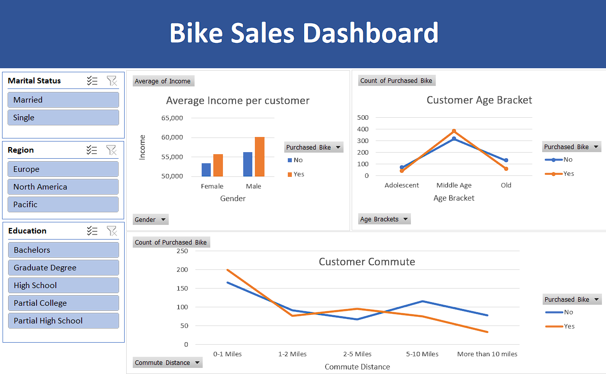

# Bike-sales-analysis
## Overview
This project analyzes a bike sales dataset to uncover key insights and trends. The dataset includes various demographic and socioeconomic attributes of customers, such as marital status, gender, income, number of children, education, occupation, home ownership, number of cars, commute distance, region, and age.

## Dataset Description

The dataset contains the following columns:

- **ID**: Unique identifier for each customer
- **Marital Status**: Marital status of the customer (Single, Married, etc.)
- **Gender**: Gender of the customer
- **Income**: Annual income of the customer
- **Children**: Number of children the customer has
- **Education**: Education level of the customer
- **Occupation**: Occupation of the customer
- **Home Owner**: Indicates if the customer owns a home
- **Cars**: Number of cars owned by the customer
- **Commute Distance**: Distance the customer commutes to work
- **Region**: Region where the customer resides
- **Age**: Age of the customer

### Tools Used
- **Excel**

## Data Preprocessing

To prepare the dataset for analysis, several preprocessing steps were performed:

1. **Marital Status**: 
   - Changed values from 'M' to 'Married' and 'S' to 'Single'.

2. **Gender**:
   - Changed values from 'f' to 'Female' and 'm' to 'Male'.

3. **Age Brackets**:
   - Added a new column called `Age Brackets` to categorise age into Adolescent, Middle Age, Old and Invalid, using the formula:
     ``` 
     IF(Age > 54, "Old", IF(Age >= 31, "Middle Age", IF(Age < 31, "Adolescent", "Invalid")))
     ```
## Dashboard

Here is a screenshot of the bike sales dashboard:



## Key Findings and Insights

1. **Income Distribution**:
   - The majority of bike buyers have an annual income between $55,000 and $60,000.
   - Higher income levels generally correlate with a higher likelihood of purchasing a bike.

2. **Marital Status**:
   - Married individuals are more likely to purchase bikes compared to single individuals.

3. **Gender Analysis**:
   - Males constitute a larger percentage of bike buyers compared to females.

4. **Education and Occupation**:
   - Customers with higher education levels (Partial High School) are more likely to purchase bikes than the ones who are graduated with a degree.

5. **Home Ownership**:
   - Homeowners are more likely to buy bikes compared to renters.
   - The number of cars owned significantly impacts the likelihood of bike purchase.

6. **Commute Distance**:
   - Customers with shorter commute distances are more likely to purchase bikes, possibly for convenience and health benefits.
   
7. **Regional Trends**:
   - Certain regions have higher bike sales, possibly due to better infrastructure, weather, or cultural factors.
   - Urban areas show higher bike sales compared to rural areas.

8. **Age Distribution**:
   - The age group 30-50 has the highest bike purchase rate.
   - Younger and older age groups show relatively lower bike purchase rates.


  
